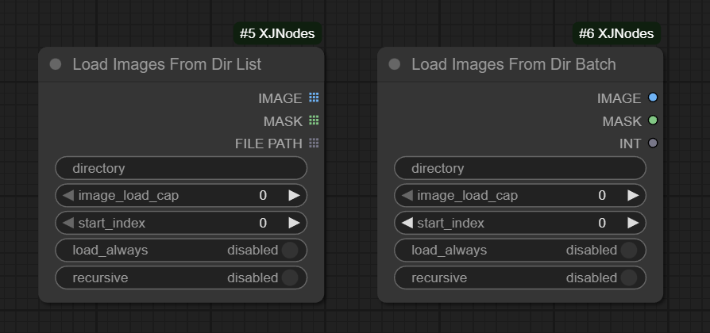
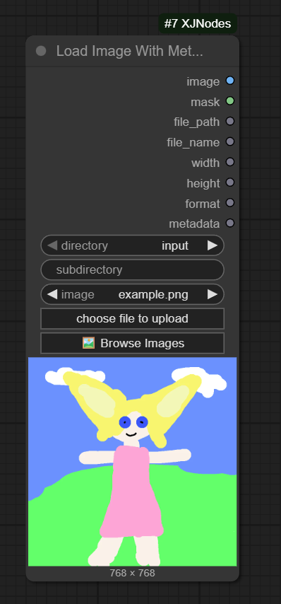
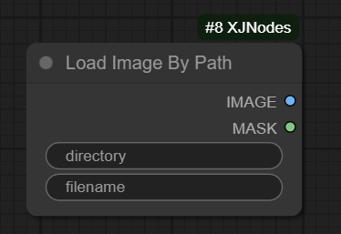
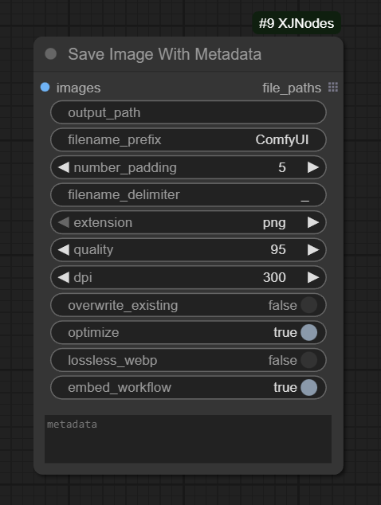
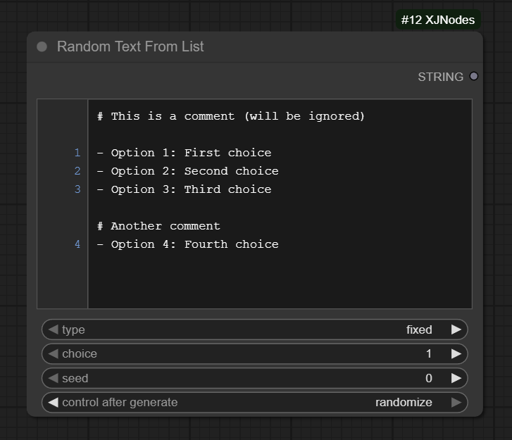
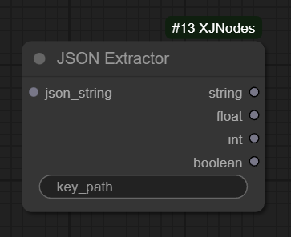
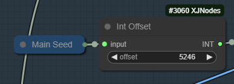

# ComfyUI-XJNodes

A modular collection of custom nodes for ComfyUI, organized by data type for easy navigation and maintenance.

**Note**: This repository is primarily for personal use and experimentation.

## Available Nodes

This package provides custom nodes organized into four main categories:

### Image Nodes

**Loaders:**
- **Load Images From Dir Batch** / **Load Images From Dir List**
  - Load multiple images from a directory as a batch/list, with options for image cap, start index.
  - Allow Recursive loading
  - Inspired by (Dr.Lt.Data's [Inspire-Pack](https://github.com/ltdrdata/ComfyUI-Inspire-Pack))

  

- **Load Image With Metadata** 
  - Load image from input/output directories with full metadata extraction 
    - dimensions
    - format
    - PNG text chunks
    - workflow data
    - extra metadata fields

    

  - Browser UI for selecting images

    

- **Load Image By Path**
  - Simple loader that takes directory and filename as string inputs
  - Useful for dynamic loading based on workflow logic (E.g. Loading image path from metadata)

  

**Savers:**
- **Save Image With Metadata**
  - Save images with embedded metadata, workflow, and custom metadata fields
  - Options for output directory, filename patterns, and format (PNG/JPEG)
  - Inspired by (WAS's [WAS Node Suite](https://github.com/WASasquatch/was-node-suite-comfyui))

  

**Transforms:**
- **Image Transform** 
  - Apply transformations to images with specified parameters
- **Image Random Transform** 
  - Apply random transformations to images for data augmentation

**Scaling:**
- **Image Scale Calc** 
  - Calculate scaling dimensions for images
- **Image Scale Megapixel** 
  - Scale images to target megapixel resolution

**Batch:**
- **Image Grid**
  - Arrange multiple images into a grid layout
- **One Image From Batch**
  - Extract a single image from a batch by index
- **Image List Filter**
  - Filter images from a list based on criteria
- **Random Images From Batch**
  - Randomly select images from a batch

**Compare:**
- **Image Pair Compare**
  - Compare two image sets with paired selection
  - Numeric tabs (1, 2, 3...) to select corresponding A/B image pairs
  - Slide and Click comparison modes
  - Image size display under each image
  - Inspired by [rgthree's Image Comparar](https://github.com/rgthree/rgthree-comfy)

### Lora Nodes

- **Conditional Lora Loader**
  - Load multiple loras dynamically with a single boolean condition
  - Enable/disable all loras with one toggle
  - Supports multiple lora inputs (lora_1, lora_2, etc.) with individual strength controls
  - Inspired by [rgthree's Power Lora Loader](https://github.com/rgthree/rgthree-comfy)

### Text Nodes

**Loaders:**
- **Random Text From List** 
  - Select text from a numbered list widget (fixed or random selection)
  - Fixed or random selection options
  - Simple YAML-like list syntax
  - Useful for prompts, captions, tags, selection.

  

- **Random Text From File** 
  - Select text from .txt or .md files in input directory (supports comments with #, list items with -)
- **Text List From File** 
  - Load all valid lines from a text file as a list

**Info:**
- **Text File Info** 
  - Get information about text files (line count, etc.)

**JSON:**
- **JSON Extractor** 
  - Extract value from JSON data structures
  - Supports x.y.z notation for nested keys
  - Useful for parsing metadata from files.

  

### Primitives

**Adapters:**
- **Scheduler Adapter** 
  - Adapter for ComfyUI scheduler compatibility
- **Sampler Adapter** 
  - Adapter for ComfyUI sampler compatibility
- **StringPass** 
  - Simple string passthrough utility

**Integers:**
- **Int Offset** 
  - Add offset to integer values
  - Add or subtract offset based on parameter
  - Useful for seed offset from main seed.

  

- **Integer Increment** 
  - Increment integer by a value

- **Integer Decrement** 
  - Decrement integer by a value

**Floats:**
- **Float Range List** 
  - Generate a list of float values within a range

### Specialized

**SUPIR:**
- **SUPIR Parameters** 
  - Helper node for SUPIR upscaling workflow parameters

## Installation

1. Navigate to your ComfyUI custom nodes directory:
```bash
cd ComfyUI/custom_nodes/
```

2. Clone this repository:
```bash
git clone https://github.com/yourusername/ComfyUI-XJNodes.git
```

3. Restart ComfyUI

## Requirements

See `requirements.txt` for any additional dependencies.


## License

This project is licensed under the GNU General Public License v3.0 (GPL-3.0).

